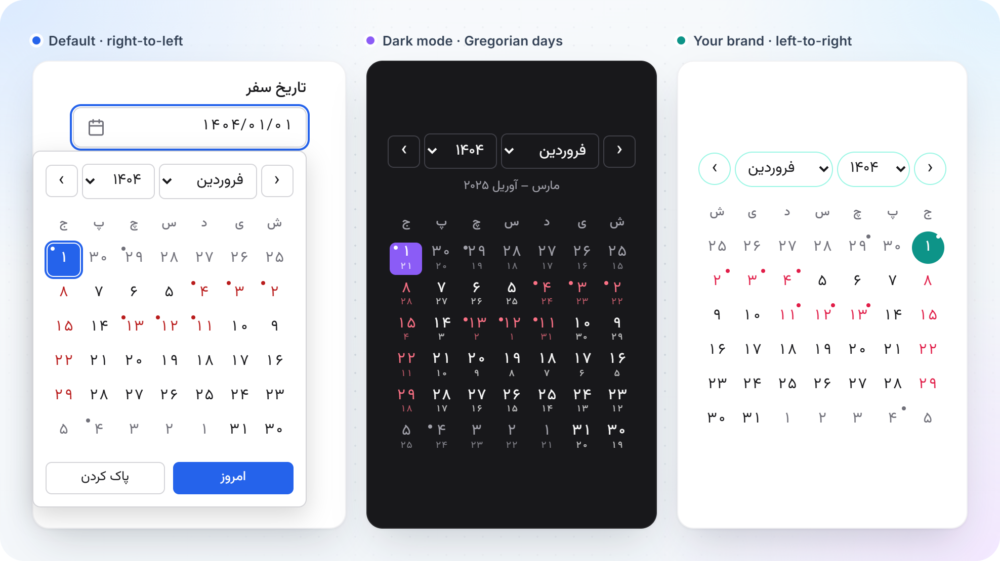

# API reference

Everything in `@amirjaz/persian-ui`, in detail. For an overview, see the
[README](../README.md).

- [Setup](#setup)
- [Utilities: `@amirjaz/persian-ui/core`](#utilities-amirjazpersian-uicore): digits,
  `normalizePersian`, keyboard layout fix, money, amounts in words, Jalali dates,
  validators, banks
- [Components: `@amirjaz/persian-ui`](#components-amirjazpersian-ui): direction,
  `PersianText`, masked inputs, `PriceInput`, `PersianDatePicker`
- [Styling](#styling): cascade layer, Tailwind, CSS variables, dark mode, shadcn/ui

## Setup

```bash
pnpm add @amirjaz/persian-ui
```

React 18 or 19 is a peer dependency, used only by the components. Import the
stylesheet once, for example in your app's entry file:

```ts
import "@amirjaz/persian-ui/styles.css";
```

### Next.js and other React Server Components setups

The components entry (`@amirjaz/persian-ui`) is marked `"use client"`. Everything
in `@amirjaz/persian-ui/core` is plain functions without React, so validators and
formatters run in Server Components, server actions and route handlers too:

```ts
// app/actions.ts
"use server";
import { validateNationalId } from "@amirjaz/persian-ui/core";
```

The components entry deliberately doesn't re-export the core functions: through a
`"use client"` module they would reach server code as client references.

---

## Utilities: `@amirjaz/persian-ui/core`

### Digits

```ts
import { toEnglishDigits, toPersianDigits } from "@amirjaz/persian-ui/core";

toPersianDigits("1404/01/15"); // "۱۴۰۴/۰۱/۱۵"
toEnglishDigits("۰۹۱۲ ٣٤٥ 6789"); // "0912 345 6789" (Persian and Arabic-Indic digits)
```

### `normalizePersian(text, { mode })`

```ts
import { normalizePersian } from "@amirjaz/persian-ui/core";

// Arabic ك and ي, a doubled ZWNJ and extra spaces:
normalizePersian("كتاب‌‌های   علي"); // "کتاب‌های علی"

// Search keys: diacritics, ZWNJ, letter variants and digit scripts all folded.
normalizePersian("می‌روم", { mode: "search" }); // "میروم"
normalizePersian("خانۀ علي", { mode: "search" }); // "خانه علی"
```

| | `standard` (default) | `search` |
|---|---|---|
| Use for | display and storage | search keys, comparisons |
| Arabic ي ى ك → Persian ی ک | ✓ | ✓ |
| Arabic presentation forms (ﻣﺤﻤﺪ) → letters | ✓ | ✓ |
| Arabic-Indic digits ٠-٩ | → Persian ۰-۹ | → Latin 0-9 (Persian digits too) |
| ۀ (two encodings) | unified to one | folded to ه |
| ZWNJ | kept only where it stops a join | removed |
| Diacritics, tatweel, bidi marks | kept | removed |
| أ إ آ ٱ ؤ ئ ة | kept | → ا ا ا ا و ی ه |
| Whitespace | spaces collapsed, line breaks kept | all collapsed |
| Latin case | kept | lowercased |

Normalizing twice gives the same result as normalizing once (property-tested).

### `fixKeyboardLayout(text, to)`

Retypes text typed with the wrong keyboard layout active: what the same keys
produce in the Persian layout (`"fa"`) or the US English one (`"en"`).

```ts
import { fixKeyboardLayout } from "@amirjaz/persian-ui/core";

fixKeyboardLayout("sghl o,fd?", "fa"); // "سلام خوبی؟"
fixKeyboardLayout("اثممخ", "en"); // "hello"
```

The Persian layout is ISIRI 9147, the standard one (Windows "Persian (Standard)",
macOS, Android, iOS), including the Shift level: uppercase Latin letters count as
Shift, so «H» becomes «آ» and «B» a ZWNJ. Characters no key produces pass through
unchanged, and the whole text is assumed to come from the other layout. In a search
box, try the query as typed first, then its retyped form.

### Money

```ts
import { formatRial, formatToman } from "@amirjaz/persian-ui/core";

formatToman(1250000); // "۱٬۲۵۰٬۰۰۰ تومان"
formatToman(1250000, { digits: "en" }); // "1,250,000 تومان"
formatToman("۱۲۵۰۰۰۰", { suffix: false }); // "۱٬۲۵۰٬۰۰۰"
formatRial(-15000); // "‎−۱۵٬۰۰۰ ریال" (the sign stays on the left inside Persian text)
formatToman(12345678901234567890n); // bigint: exact beyond Number.MAX_SAFE_INTEGER
```

Options: `suffix` (default `true`), `digits` (`"fa"` default, or `"en"`) and
`separator` (default `٬` with Persian digits, `,` with Latin). Amounts can be
numbers, bigints or numeric strings in any digit script. The output follows CLDR's
Persian number format, the same as `Intl.NumberFormat("fa-IR")`.

### Amounts in words: `numberToWords`

```ts
import { numberToWords } from "@amirjaz/persian-ui/core";

numberToWords(1250000); // "یک میلیون و دویست و پنجاه هزار"
numberToWords("۲۰۲۵"); // "دو هزار و بیست و پنج"
numberToWords(-7); // "منفی هفت"
numberToWords(1000); // "یک هزار"
```

Whole numbers only, as numbers, bigints or numeric strings in any digit script (with
separators), up to 10¹⁸ − 1 (scale words up to کوادریلیون). Fractions, numbers
beyond `Number.MAX_SAFE_INTEGER` (pass a bigint or a string) and malformed input
throw a `RangeError`. `PriceInput` can show the amount in words under the field
(`showWords`).

### Jalali dates

Dates are exchanged as ISO strings (`"YYYY-MM-DD"`, Gregorian), which have no
time zone. Jalali dates are `{ year, month, day }` objects.

Unlike a `Date`, an ISO date string can't shift by a day on its way to the server
(`toISOString()` on a Tehran midnight gives the previous day in UTC). Day arithmetic
works on day numbers, never by adding 24 hours, so daylight-saving days (Iran observed
DST until 1401) can't skip or repeat a day. Conversion uses Borkowski's algorithm,
tested day by day against jalaali-js for 1200–1600 and against the browser's own
Persian calendar for 1300–1500.

```ts
import {
  formatJalali,
  isLeapJalaliYear,
  isValidJalaliDate,
  jalaliMonthLength,
  parseJalali,
  toGregorian,
  toJalali,
} from "@amirjaz/persian-ui/core";

toJalali("2025-03-21"); // { year: 1404, month: 1, day: 1 }
toGregorian({ year: 1404, month: 1, day: 1 }); // "2025-03-21"
formatJalali("2025-04-04"); // "۱۴۰۴/۰۱/۱۵"
formatJalali("2025-04-04", { format: "long", weekday: true }); // "جمعه ۱۵ فروردین ۱۴۰۴"
parseJalali("۱۴۰۴/۱/۱۵"); // { year: 1404, month: 1, day: 15 }; null if not a real date
isLeapJalaliYear(1403); // true
jalaliMonthLength(1404, 12); // 29
isValidJalaliDate({ year: 1404, month: 12, day: 30 }); // false: 1404 isn't a leap year
```

`toJalali` and `formatJalali` also accept a `Date` (its local calendar day).
`JALALI_MONTH_NAMES` and `PERSIAN_WEEKDAY_NAMES` (Saturday first) are exported
too. Supported years: −61 to 3177.

### Validators

Every validator accepts Persian, Arabic-Indic and Latin digits, with the spaces,
dashes and invisible marks that come with pasted text, and returns either the
normalized value or a reason:

```ts
import { validateIranianMobile, validateNationalId, validationMessages } from "@amirjaz/persian-ui/core";

validateIranianMobile("+98 912 345 6789");
// { valid: true, value: "09123456789", e164: "+989123456789", operator: "MCI" }

const result = validateNationalId("۰۰۱-۲۳۴۵۶۷-۸");
// { valid: false, reason: "checksum" }
if (!result.valid) console.log(validationMessages.nationalId[result.reason]); // "کد ملی معتبر نیست."
```

| Validator | Accepts | Valid result | Reasons |
|---|---|---|---|
| `validateNationalId(code, { padShort })` | 10 digits; with `padShort`, also 8–9 digits whose leading zeros were lost (spreadsheets) | `value` | `empty` `invalidCharacters` `length` `repeatedDigits` `zeroSerial` `checksum` |
| `validateIranianMobile(number)` | `09…`, `+989…`, `00989…`, `989…`, `9…` | `value` (`09…`), `e164`, `operator` | `empty` `invalidCharacters` `countryCode` `notMobile` `length` |
| `validateSheba(iban)` | `IR` + 24 digits, or the 24 digits alone, any case | `value` (`IR…`), `bank` | `empty` `invalidCharacters` `country` `length` `checksum` |
| `validateCardNumber(card)` | 16 digits, usually in groups of four | `value`, `bank` | `empty` `invalidCharacters` `length` `repeatedDigits` `checksum` |
| `validatePostalCode(code, { strict })` | 10 digits, usually written «۱۳۴۵۶-۷۸۹۱۴» | `value` | `empty` `invalidCharacters` `length` `repeatedDigits` `pattern` |
| `validatePlate(plate, { strict })` | «۱۲ ب ۳۴۵ ایران ۶۷», `12ب345-67`, `12ب34567`, «ا» for «الف» | `value` (`12ب345-67`), `parts` | `empty` `format` `letter` `region` `zeroDigit` |

Notes:

- **National ID:** digits 1–9 weighted 10…2, sum mod 11. Codes made of a single
  repeated digit pass the checksum but are never issued, so they are rejected, as
  are codes whose digits 4–9 are all zero.
- **Mobile:** any `09` number with 11 digits is valid, so newly allocated prefixes
  work. `operator` is the operator a prefix was *originally* allocated to (MCI,
  Irancell or Rightel, else `null`). Numbers have been portable between operators
  since 2016, so it isn't necessarily the current one.
- **Postal code:** Iran Post publishes no digit rules beyond "10 digits". The
  opt-in `strict` rule (no 0 or 2 in the first five digits) is widely used and
  matches every real code we found, but it isn't official.
- **Plates:** all issued letters are accepted, including الف پ ت ث ز ژ ش ع ف ک گ.
  `strict` also rejects 0 in the number groups (never issued there, according to
  Wikipedia).
- **Card numbers:** the Luhn checksum. A number made of one repeated digit passes it
  but is never issued, so it is rejected.
- `validationMessages` holds a Persian message for every validator and reason.
  `PLATE_LETTERS` lists the plate letters.

### Banks

`validateCardNumber` and `validateSheba` name the bank (`bank`), and so do these,
which also work on a partial number while the user is still typing:

```ts
import { getBankFromCardNumber, getBankFromSheba, IRANIAN_BANKS } from "@amirjaz/persian-ui/core";

getBankFromCardNumber("6037 99"); // { id: "melli", name: "بانک ملی ایران" }
getBankFromSheba("IR06 0170 …"); // { id: "melli", name: "بانک ملی ایران" }
getBankFromCardNumber("6273 81"); // { id: "sepah", name: "بانک سپه", formerly: "بانک انصار" }
getBankFromCardNumber("4111 11"); // null
```

- `id` is a stable English slug (`"melli"`, `"mellat"`, `"tosee-saderat"`…) for keys
  and logos; `name` is Persian.
- Banks that merged into another report the bank that serves their cards and
  accounts today, with `formerly` holding the name printed on the card: Ansar,
  Ghavamin, Hekmat Iranian, Kosar and Mehr Eqtesad → Sepah (1399); Noor → Melli
  (1402); Ayandeh → Melli (1404).
- `IRANIAN_BANKS` is the table itself: `{ id, name, cardPrefixes, shebaCodes, mergedInto? }`.
  There is no official public list of card prefixes, so a prefix is included only
  when at least two independent sources agree; unknown prefixes give `null`, and
  those cards still validate.

---

## Components: `@amirjaz/persian-ui`

### Direction

Components follow the direction of the page by default. `DirectionProvider` sets
it explicitly, and every component also takes a `dir` prop. The order of
precedence: the `dir` prop, then the provider, then the page. When the direction
is explicit, the component writes `dir` on its own root, so its layout and its
arrow keys always agree, even inside a page of the opposite direction.

```tsx
import { DirectionProvider, useDirection } from "@amirjaz/persian-ui";

<DirectionProvider dir="rtl">
  <App />
</DirectionProvider>;

useDirection(); // "rtl" inside the provider, undefined outside it
```

### `PersianText`

```tsx
import { PersianText } from "@amirjaz/persian-ui";

<PersianText>{"برای پشتیبانی با شماره +98 912 345 6789 تماس بگیرید."}</PersianText>
// <span dir="rtl">برای پشتیبانی با شماره <bdi dir="ltr">+98 912 345 6789</bdi> تماس بگیرید.</span>

<PersianText digits="fa">{"iPhone 15 با قیمت 45000000 تومان"}</PersianText>
// digits become Persian, except inside Latin text: «iPhone 15» stays as is
```

| Prop | Default | |
|---|---|---|
| `children` | | The text (a string). |
| `as` | `"span"` | The element to render. |
| `normalize` | `true` | Apply `normalizePersian` (standard mode). |
| `digits` | `"keep"` | `"fa"` or `"en"` to convert digits. |
| `dir` | `"rtl"` | Base direction of the text. |

It isolates phone numbers, ranges («۱۰-۲۰»), dates, grouped numbers
(«۱٬۲۵۰٬۰۰۰»), versions, e-mail addresses and URLs, while keeping a sentence's
closing punctuation with the sentence.

### Masked inputs: `NationalIdInput`, `MobileInput`, `ShebaInput`, `CardNumberInput`

```tsx
import { CardNumberInput, MobileInput, NationalIdInput, ShebaInput } from "@amirjaz/persian-ui";

<NationalIdInput
  label="کد ملی"
  hint="ده رقم روی کارت ملی"
  onValueChange={(value, result) => {
    // value: Latin digits, e.g. "0012345678"; result: validateNationalId(value)
  }}
/>

<MobileInput label="تلفن همراه" onValueChange={(value, result) => result.valid && result.operator} />

<ShebaInput label="شماره شبا" hint="۲۴ رقم بعد از IR" />

<CardNumberInput label="شماره کارت" onValueChange={(value, result) => result.valid && result.bank?.name} />
```

They format while the user types or pastes, in any digit script:

| Input | Shows | Value |
|---|---|---|
| `NationalIdInput` | ۰۰۱-۲۳۴۵۶۷-۸ | `"0012345678"` |
| `MobileInput` | ۰۹۱۲ ۳۴۵ ۶۷۸۹ (also from pasted `+98 …` or `0098 …`) | `"09123456789"` |
| `ShebaInput` | IR ۰۶ ۰۱۲۰ ۰۰۰۰ … (IR is a fixed prefix) | `"IR06012…"` |
| `CardNumberInput` | ۶۰۳۷ ۹۹۰۰ … in groups of four | `"603799…"` (16 digits) |

The caret stays next to the digit being edited while separators come and go, and
Backspace or Delete next to a separator removes the neighbouring digit instead of
getting stuck. Errors appear in Persian once the field loses focus or holds a
complete value, never mid-typing, and are announced to screen readers.

Shared props:

| Prop | |
|---|---|
| `value`, `defaultValue`, `onValueChange(value, result)` | Normalized value (Latin digits); `""` when empty. |
| `label`, `hint` | Wired to the input with `<label>` and `aria-describedby`. |
| `error` | An error to show instead of the built-in one, e.g. from your server. |
| `messages` | Replace any of the Persian messages, per reason. |
| `digits` | `"fa"` (default) or `"en"`: the digits shown while typing. |
| `name` | Submits the normalized value with native forms and server actions. |
| `dir`, `className` | Layout direction and a class for the root element. |
| other props | `required`, `disabled`, `placeholder`, `aria-*`, events… go to the `<input>`, which receives the `ref`. |

With react-hook-form, use a `Controller` and `onValueChange`.

**Banks.** `CardNumberInput` and `ShebaInput` name the bank at the end of the field
as soon as the number tells it (a card's first six digits, a Sheba's three-digit bank
code), include it in the input's description, and set `data-bank` (the bank's `id`)
on the root. The library ships no logos, but you can add your own with CSS:

```css
.pui-field[data-bank="melli"] .pui-field__bank::before {
  content: url("/banks/melli.svg");
}
```

Cards and accounts of merged banks show the bank that serves them today (see
[Banks](#banks)). `showBank={false}` turns this off. `CardNumberInput` also sets
`autocomplete="cc-number"`, so browsers can fill in saved cards.

### `PriceInput`

```tsx
import { PriceInput } from "@amirjaz/persian-ui";

<PriceInput
  label="مبلغ"
  onValueChange={(toman, { rial, unit }) => {
    // toman: 1500000 while the screen shows ۱٬۵۰۰٬۰۰۰
  }}
/>
```

The value is always in **toman**. The toman/rial switch (a radio group whose
arrow keys follow the reading direction) only changes the unit the user types in:
typing ۱٬۵۰۰ in rial gives `150` toman. Rial amounts that aren't a multiple of 10
keep their fraction (`12345` rial → `1234.5` toman). Other props: `value`,
`defaultValue`, `unit`, `defaultUnit`, `onUnitChange`, `showUnitToggle`, and
`labels` for the unit names, plus the shared props above.

`showWords` adds the amount in words under the field, in the unit being typed
(«یک میلیون و پانصد هزار تومان»; a fractional toman reads «دوازده تومان و پنج
ریال»), and includes it in the input's description.

### `PersianDatePicker`



```tsx
import { PersianDatePicker } from "@amirjaz/persian-ui";

const [date, setDate] = useState<string | null>(null);

<PersianDatePicker
  label="تاریخ تحویل"
  value={date}
  onValueChange={(iso, { jalali, date }) => setDate(iso)}
  min="2025-03-21"
  isDateDisabled={(iso) => new Date(`${iso}T12:00:00Z`).getUTCDay() === 5} // no Fridays
  showGregorian
/>;
```

Users can type the date («۱۴۰۴/۰۱/۱۵», `1404-1-15`, or `14040115` on number-only
keyboards) or open the calendar with the button or Alt+↓. The calendar opens in a
modal dialog that keeps focus inside it. Escape closes it and returns focus to the
button. It opens above the field when there's no room below, and renders inside
the field (no portal), so it inherits the direction and your CSS variables.

| Prop | Default | |
|---|---|---|
| `value`, `defaultValue` | `null` | ISO date (`"2025-04-04"`) or `null`. |
| `onValueChange(iso, { jalali, date })` | | Also gives the Jalali date and a local-midnight `Date`. |
| `min`, `max` | | ISO dates, inclusive. |
| `isDateDisabled(iso)` | | Return `true` to block a day. |
| `showGregorian` | `false` | Gregorian day numbers and months alongside. |
| `showHolidays` | `true` | Iranian public holidays. Lunar ones use the arithmetic Hijri calendar, so they can be a day off the announced date. |
| `digits` | `"fa"` | Digits in the field and the calendar. |
| `weekStartsOn` | `6` | `6` = Saturday, `0` = Sunday. |
| `month`, `defaultMonth`, `onMonthChange` | | Displayed month, as `{ year, month }` (Jalali). |
| `yearRange` | `{ back: 100, forward: 10 }` | Years offered in the year list. |
| `open`, `defaultOpen`, `onOpenChange` | | Control the calendar dialog. |
| `showFooter` | `true` | Today and Clear buttons. |
| `asChild` + one child | | Use your own element as the calendar button. |
| `label`, `hint`, `error`, `placeholder`, `name`, `required`, `disabled` | | As on the inputs. |
| `labels`, `messages`, `classNames` | | Override texts and add classes per part. |

`PersianCalendar` is the calendar on its own (always visible), with the same
value, month, range, holiday and display props.

**Keyboard** (WAI-ARIA grid pattern):

| Key | Moves to |
|---|---|
| ← / → | Next / previous day in right-to-left text, the other way round in left-to-right |
| ↑ / ↓ | Same day in the previous / next week |
| Home / End | First / last day of the week |
| PageUp / PageDown | Same day in the previous / next month |
| Shift + PageUp / PageDown | Same day in the previous / next year |
| Enter / Space | Selects the day |
| Escape | Closes the dialog |

Month changes are announced to screen readers, each day is announced with its
full date and holiday («جمعه ۱ فروردین ۱۴۰۴، تعطیل: نوروز»), and today is marked
with `aria-current="date"`.

### `PersianDateRangePicker` and `PersianRangeCalendar`

```tsx
import { PersianDateRangePicker, type DateRange } from "@amirjaz/persian-ui";

const [trip, setTrip] = useState<DateRange>({ start: null, end: null });

<PersianDateRangePicker
  label="تاریخ سفر"
  value={trip}
  onValueChange={(range, { start, end }) => setTrip(range)}
  min="2025-03-21"
  startName="checkIn"
  endName="checkOut"
/>;
```

One field with two inputs, «از» and «تا», and one calendar button. Each input
takes typed dates like `PersianDatePicker`; an end before the start is reported
(`order` message) instead of committed. In the calendar, the first click sets the
start and the dialog stays open, showing the range up to the hovered or focused
day; the next click on or after the start sets the end and closes the dialog, and a
click before the start starts over from that day. A range may include disabled
days.

- The value is `{ start, end }` with ISO dates or `null` (empty is
  `{ start: null, end: null }`); `onValueChange(range, { start, end })` fires on every
  change, including a start without an end, and also gives each day's Jalali date
  and `Date`.
- `startName` / `endName` submit the two ISO dates with native forms.
- `required` asks for both dates. `showFooter` shows the Clear button.
- The other props match `PersianDatePicker`: `min`, `max`, `isDateDisabled`,
  `showGregorian`, `showHolidays`, `digits`, `weekStartsOn`, `month`,
  `yearRange`, `open`, `asChild`, `labels` (plus `from`, `to`, `rangeStart`,
  `rangeEnd`, `selectEnd`), `messages` (plus `order`) and `classNames` (plus
  `startInput`, `endInput`, `dayRangeStart`, `dayInRange`, `dayRangeEnd`,
  `dayRangePreview`).

`PersianRangeCalendar` is the range calendar on its own. The start and end days are
announced as «آغاز بازه» and «پایان بازه», every day of the range is
`aria-selected`, and «تاریخ پایان را انتخاب کنید.» is announced once the start is
picked.

---

## Styling

`styles.css` puts every rule in a `@layer persian-ui` cascade layer, so any CSS of
yours that isn't in a layer wins, whatever its specificity. Selectors are single
classes (`.pui-calendar__day`), and state is exposed as data attributes
(`[data-selected]`, `[data-today]`, `[data-disabled]`, `[data-outside]`,
`[data-weekend]`, `[data-holiday]`, `[data-invalid]`, `[data-side]`,
`[data-range-start]`, `[data-in-range]`, `[data-range-end]`, `[data-range-preview]`,
`[data-bank]`), which you can target from plain CSS or Tailwind
(`data-[selected]:bg-…`).

**Tailwind CSS v4:** declare the layer order first, so your utility classes also
beat the library's styles:

```css
@layer theme, base, persian-ui, components, utilities;
@import "tailwindcss";
@import "@amirjaz/persian-ui/styles.css";
```

**Older browsers:** browsers from before cascade layers (Chrome/Edge 99, Safari
15.4, Firefox 97) ignore a whole `@layer` block. For them, import
`@amirjaz/persian-ui/styles.unlayered.css` instead: the same rules without the
layer. Everything else needs Chrome/Edge 87+, Safari 14.1+ or Firefox 66+.

### CSS variables

Set any of these on `:root`, on a wrapper, or on a single component. Global
variables have defaults on `:root`. Component variables have no default of their
own: they fall back to a global one, so setting them anywhere just works.

| Global variable | Default | Used for |
|---|---|---|
| `--pui-font-family` | `inherit` | All components |
| `--pui-font-size` | `0.9375rem` | All components |
| `--pui-line-height` | `1.5` | Fields |
| `--pui-color-text` | `#18181b` | Text |
| `--pui-color-muted` | `#71717a` | Hints, placeholders, weekday names, other months' days |
| `--pui-color-background` | `#ffffff` | Field background, selected unit |
| `--pui-color-surface` | `#ffffff` | Calendar and dialog background |
| `--pui-color-border` | `#d4d4d8` | Borders |
| `--pui-color-hover` | `#f4f4f5` | Hover background, unit switch |
| `--pui-color-accent` | `#2563eb` | Selected day, today, primary button |
| `--pui-color-accent-contrast` | `#ffffff` | Text on the accent colour |
| `--pui-color-range` | `#dbeafe` | Days inside a date range, and its preview |
| `--pui-color-danger` | `#b91c1c` | Errors and invalid borders |
| `--pui-color-holiday` | `#b91c1c` | Fridays and holidays |
| `--pui-color-focus-ring` | `#2563eb` | Focus outlines |
| `--pui-focus-ring-width` | `2px` | Focus outlines |
| `--pui-radius` | `0.5rem` | Corners |
| `--pui-control-height` | `2.5rem` | Field height |
| `--pui-shadow-popup` | `0 8px 24px rgb(0 0 0 / 0.16)` | Date picker dialog |
| `--pui-z-index-popup` | `50` | Date picker dialog |

| Component variable | Falls back to | Used for |
|---|---|---|
| `--pui-field-height` | `--pui-control-height` | Field height |
| `--pui-field-gap` | `0.375rem` | Space between label, field, hint and error |
| `--pui-field-label-weight` | `500` | Label font weight |
| `--pui-field-padding-inline` | `0.75rem` | Field padding |
| `--pui-field-border-width` | `1px` | Field border (the dialog lines up with its outer edge) |
| `--pui-field-border-color` | `--pui-color-border` | Field border |
| `--pui-field-radius` | `--pui-radius` | Field corners |
| `--pui-field-background` | `--pui-color-background` | Field background |
| `--pui-price-input-units-background` | `--pui-color-hover` | Toman/rial switch |
| `--pui-calendar-padding` | `0.75rem` | Calendar padding |
| `--pui-calendar-background` | `--pui-color-surface` | Calendar background |
| `--pui-calendar-gap` | `2px` | Space between days |
| `--pui-calendar-cell-size` | `2.25rem` | Size of a day |
| `--pui-date-picker-offset` | `0.25rem` | Gap between the field and the dialog |

**Dark mode**, under your own selector:

```css
.dark {
  --pui-color-text: #fafafa;
  --pui-color-muted: #a1a1aa;
  --pui-color-background: #09090b;
  --pui-color-surface: #18181b;
  --pui-color-border: #3f3f46;
  --pui-color-hover: #27272a;
  --pui-color-accent: #3b82f6;
  --pui-color-danger: #f87171;
  --pui-color-holiday: #f87171;
  --pui-color-range: #1e3a8a;
  --pui-color-focus-ring: #60a5fa;
}
```

**shadcn/ui:** map its theme onto these variables (with Tailwind v3's HSL
triplets, wrap each one: `hsl(var(--primary))`):

```css
:root {
  --pui-color-text: var(--foreground);
  --pui-color-muted: var(--muted-foreground);
  --pui-color-background: var(--background);
  --pui-color-surface: var(--popover);
  --pui-color-border: var(--border);
  --pui-color-hover: var(--accent);
  --pui-color-accent: var(--primary);
  --pui-color-accent-contrast: var(--primary-foreground);
  --pui-color-danger: var(--destructive);
  --pui-color-focus-ring: var(--ring);
  --pui-radius: var(--radius);
}
```

The library ships no font. Vazirmatn works well with it.
